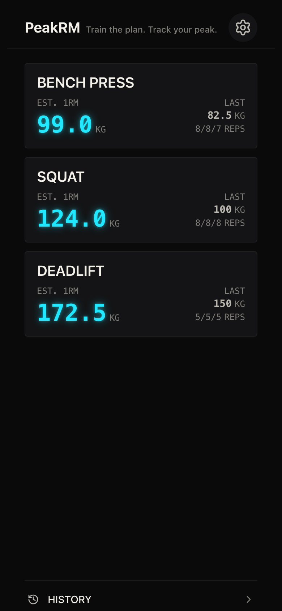
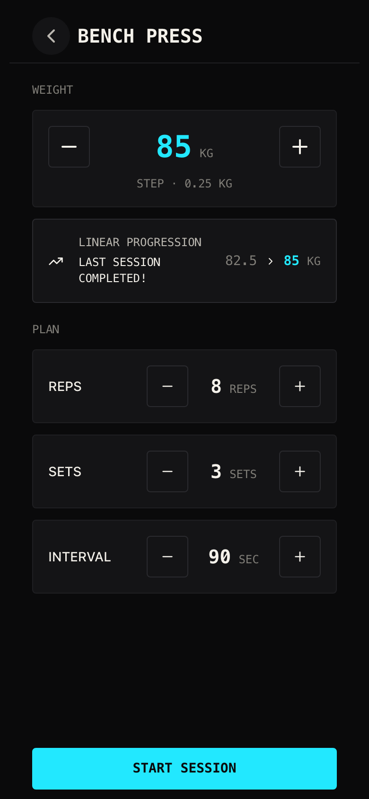
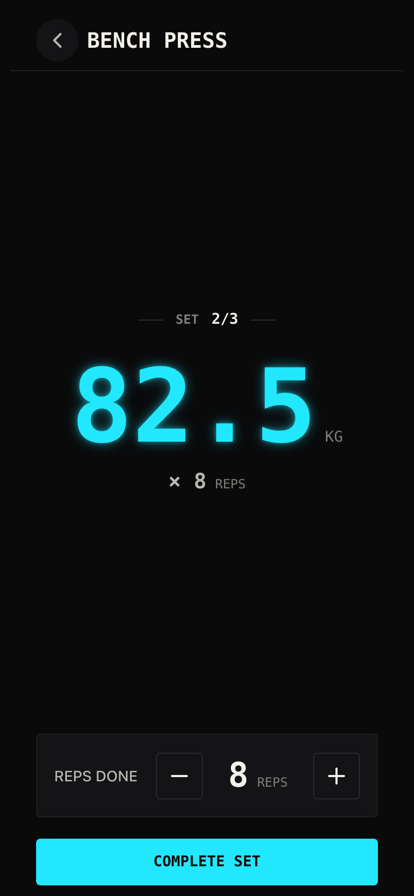
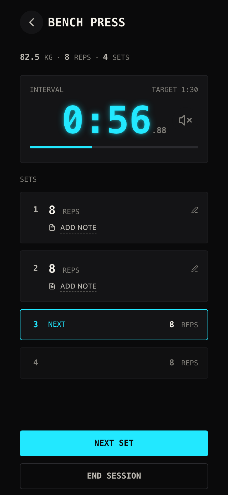
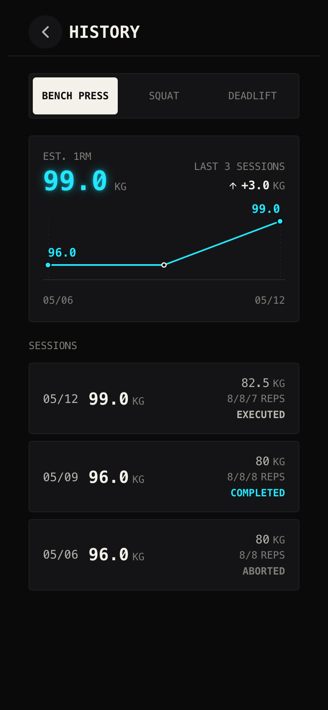
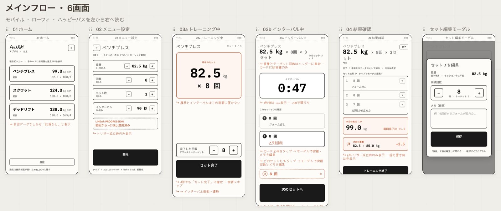
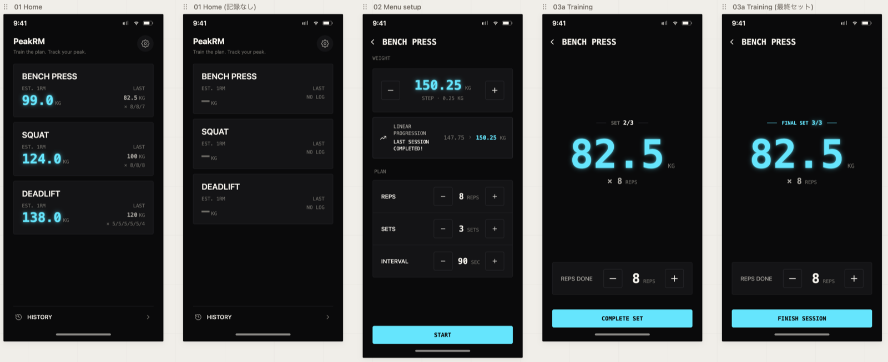

# PeakRM

1RM の成長を可視化するシンプルなトレーニングアプリ。ベンチプレス / スクワット / デッドリフトの記録から推定 1RM を算出し、その推移を追う PWA。データはログイン不要で端末ローカル（IndexedDB）に保存する。

**Live: [peak-rm.pages.dev](https://peak-rm.pages.dev/)**（個人用のため `noindex` で検索エンジンには載せていない。PWA としてホーム画面に追加できる）

進捗と残作業は [GitHub Issues](https://github.com/umi-kappa/peak-rm/issues) を正本とする。

## コンセプト

**計画通りに実行させる筋トレアプリ（甘え防止）**。トレーニング中の意思決定を排除することを核の価値に置く。

- **メニューはトレーニング前に確定する**。開始時点のメニューはセッションに焼き込まれ、実行中は変更できない（UX 上の制約ではなく設計上の不変条件）
- **「入力」ではなく「実行」にフォーカスする**。操作ステップを最小化し、確認ダイアログや設定変更の導線をトレーニング画面に持ち込まない（例外は破壊的操作である中断と、トレーニング中・インターバル中からのセッションフロー離脱のみ）
- **記録するのは実績のみ**。セットのスキップもセッションの中断も記録対象で、なかったことにはしない
- **増量は自動で提案する**（linear progression）。直前セッションを完遂していれば、次回のメニューに増量幅を上乗せした重量を初期表示する

利便性のために選択肢を増やす変更はこのコンセプトと衝突するため、種目の追加・クラウド同期・詳細分析・トレーニング挙動を変える設定項目は意図的にスコープ外としている。想定ユーザーは作者本人および同じ価値観を持つ個人トレーニーで、linear progression が機能する初心者〜中級者期間を対象とする。

判断の背景は [docs/spec.md](docs/spec.md) と [docs/decisions/](docs/decisions/README.md) に集約している。

## 主な機能

<p>
  
  
  
  
  
</p>

| 画面           | 内容                                                                                        |
| -------------- | ------------------------------------------------------------------------------------------- |
| ホーム         | 3 種目の選択。前回の記録と現状の推定 1RM を表示                                             |
| メニュー設定   | 重量 / 回数 / セット数 / インターバルの設定。linear progression による増量提案              |
| トレーニング中 | 現在のセット表示と「セット完了」（実績回数のステッパー付き）                                |
| インターバル中 | セット間タイマー（タイマー音 / Screen Wake Lock）・実施済みセットのタイムライン・セットメモ |
| 結果確認       | セッション終了後のサマリと 1RM 差分。履歴から開いた場合はセッションの削除も可能             |
| 履歴           | セッション一覧と 1RM 推移グラフ（日付ごと 1 点・直近 8 点）                                 |
| 設定           | データ Export / Import・アプリバージョン表示                                                |

画面ごとの仕様は [docs/spec.md](docs/spec.md) の「画面構成」節を正本とする。推定 1RM は FWJ 換算式（ベンチプレスは `w × (1 + r / 40)`、スクワット / デッドリフトは `w × (1 + r / 33.3)`）で算出する。

## デザインの経緯

画面デザインは Claude Design で起こし、確定したトークンと画面構造を [docs/design/README.md](docs/design/README.md) に正本として書き起こしてから実装に入った。手直しの一部始終は [Issue #4](https://github.com/umi-kappa/peak-rm/issues/4) に残している。

1. **ワイヤーフレーム**。仕様（[docs/spec.md](docs/spec.md)）からメインフロー 6 画面をローファイで起こす。この段階で「履歴とインターバルはトレーニング画面に置かない」「重量とターゲット回数はヘッダーに集約し、カードには実績だけ」といった画面の責務が決まり、仕様書へ書き戻した

   

2. **デザイン初稿**。ワイヤーフレームと仕様に方向づけ（ダーク基調・サンセリフ + モノスペース数字・アクセントはシアン 1 色・390px・8px グリッド・ステッパーだけハイファイに）を添えて静的モックを生成した。初稿は要素が多く、色・フォントサイズ・余白がルール無しにばらついていたので、何を削り何を揃えるかを指示し続けた
3. **デザイントークンの抽出**。できた画面から使っている色・フォント・余白を列挙させ、不要なものを削って画面へ反映した。色の統合はうまくいったが、フォントサイズ 6 段階と太さの割り当ては最後まで手で調整した

   

4. **実装へ**。トークンは `src/styles/tokens.css` へ、画面構造は design README へ移し、細かい余白や幅は実装側で決めた。Claude Design が出力した React プロトタイプは役目を終えて削除した（#119）。3 次テキストのコントラストが WCAG AA に届いていなかったのは実装後に測って直し（#110 / #115）、アプリアイコンは生成 AI で方向性を出してから maskable のセーフゾーンに合わせて整えた（#109）

やってみて分かったこと:

- ワイヤーフレームからデザインを起こす工程と、画面からトークンを列挙させる工程は速い
- 初稿は要素も値もばらつく。削るものと揃える値を自分で判断できないと、使いづらい UI がそのまま残る
- デザインを進めると仕様の穴が見えてくる。仕様書の更新はデザイン工程の一部として扱う

## Storybook / ビジュアルテスト

UI コンポーネントは Storybook でカタログ化し、`main` への push で Chromatic に自動デプロイしている。

- **[Storybook](https://main--6a16dbf86b6f51628d6ee2a9.chromatic.com/)** — 各コンポーネントの状態バリエーションと、`play` 関数によるインタラクションを実際に操作できる
- **[Chromatic のビルド一覧](https://www.chromatic.com/builds?appId=6a16dbf86b6f51628d6ee2a9)** — スナップショット差分によるビジュアルリグレッションテストの結果

## 技術スタック

| 区分                     | 採用                                                                                                            |
| ------------------------ | --------------------------------------------------------------------------------------------------------------- |
| フレームワーク           | Vue 3 + Vite + TypeScript（Composition API + `<script setup>`）                                                 |
| ルーティング             | vue-router                                                                                                      |
| スタイリング             | scoped CSS + CSS カスタムプロパティ（Tailwind なし）                                                            |
| グラフ                   | vue-chartjs（Chart.js ベース）                                                                                  |
| ストレージ               | IndexedDB（Dexie.js）                                                                                           |
| PWA                      | vite-plugin-pwa（インストール可能・オフライン対応）                                                             |
| コンポーネント開発       | Storybook（Vue 3 + Vite）                                                                                       |
| テスト                   | Vitest projects（ロジックは `happy-dom`、Story の `play` 関数は `@storybook/addon-vitest` + headless Chromium） |
| ビジュアルリグレッション | Chromatic                                                                                                       |
| Lint / Format            | ESLint + Prettier                                                                                               |
| Git hooks                | husky + lint-staged                                                                                             |
| CI / デプロイ            | GitHub Actions / Cloudflare Pages（本体）・Chromatic（Storybook）                                               |

この表を採用技術の正本とし、選定の背景は次の「設計判断のハイライト」と [docs/decisions/](docs/decisions/README.md) に置く。

## 設計判断のハイライト

読みどころは「何を採用したか」より「何を採用しなかったか、なぜか」にある。各項目の背景・退けた案・帰結は ADR に書いている。

- **Pinia を使わない**。共有状態は実行中セッションだけなので、`useSession` の単一インスタンスを `app.provide()` で配る。router のガードも Storybook の fake 差し替えも同じ配線で成立する（[ADR 0001](docs/decisions/0001-session-state-via-provide.md)）
- **Tailwind / Sass を使わない**。プレーン CSS + カスタムプロパティで足り、トークンの正本がデザインと 1 対 1 になる。scoped CSS の境界はクラス指定でなくトークン再定義で越える（[ADR 0002](docs/decisions/0002-plain-css-with-custom-properties.md) / [ADR 0007](docs/decisions/0007-scoped-css-boundary-token-redefinition.md)）
- **ロジックは Vitest、見た目は Storybook + Chromatic で分担する**。同じ振る舞いを 2 層で書かない。Story を書けば自動でテストになり、Chromatic の snapshot にもなる（[ADR 0003](docs/decisions/0003-test-split-vitest-storybook-chromatic.md)）
- **「メニューは変更不可」を状態モデルで担保する**。開始時に deep copy して `Readonly` で焼き込み、UI 制御ではなく型と状態で守る（[ADR 0004](docs/decisions/0004-menu-immutability-in-state-model.md)）
- **No ARIA is better than bad ARIA**。複合 role を自作せず、名前付けとグループ化だけを足す。キーボードはネイティブの範囲まで保証する（[ADR 0005](docs/decisions/0005-accessibility-native-scope.md)）
- **エラー境界は 1 箇所、縮退は明示的にオプトインする**。「根幹を壊すか」で分類し、迷ったら catch しない（[ADR 0006](docs/decisions/0006-single-error-boundary-explicit-degradation.md)）

## ドキュメント

| ドキュメント                                   | 内容                                                                                       |
| ---------------------------------------------- | ------------------------------------------------------------------------------------------ |
| [docs/spec.md](docs/spec.md)                   | 仕様の唯一のソース。コンセプト・機能仕様・1RM 計算式・データモデル・エラーハンドリング方針 |
| [docs/conventions.md](docs/conventions.md)     | コーディング・命名・アクセシビリティ・テスト・スタイル・ドキュメント表記の規約             |
| [docs/decisions/](docs/decisions/README.md)    | 設計判断の記録（ADR）。背景・退けた代替案・帰結                                            |
| [docs/design/README.md](docs/design/README.md) | デザイントークン（色・タイポグラフィ・スペーシング）・画面リファレンス・トーンガイド       |
| [AGENTS.md](AGENTS.md)                         | AI コーディングエージェント向けのリポジトリガイド                                          |

## ディレクトリ構成

`src/` は責務で分割し、各レイヤを **画面専用（`pages/<画面>/`）** と **横断（`shared/`）** で分岐する。

- `core/` 純ロジック（副作用なし）・`storage/` 永続化（Dexie / IndexedDB）・`composables/` Vue composable・`components/` Vue コンポーネント・`pages/` 画面エントリ・`router/`・`assets/icons/`（lucide 純正 SVG）・`styles/` トークンとグローバル CSS・`stories/` Storybook 補助

ツリー全体と分岐ルール（`shared/` の使い分け、`core ↔ storage` の依存方向など）は [docs/conventions.md](docs/conventions.md) の「ディレクトリ構成」節を正本とする。

## 開発

Node 22 LTS / npm 前提。

```bash
npm install
npm run dev      # http://localhost:5173 で起動
npm run build    # dist/ に本番ビルド生成
npm run preview  # build 後の dist/ をローカルで確認
```

### Lint / Format

```bash
npm run lint          # ESLint で静的解析
npm run lint:fix      # ESLint の自動修正
npm run format        # Prettier で整形
npm run format:check  # Prettier の差分確認のみ
```

### テスト

初回のみ、Story テスト用に Playwright の Chromium を取得する。

```bash
npx playwright install chromium
```

```bash
npm test              # 全テストを 1 回実行（unit + Story の play 関数）
npm run test:storybook # Story の play 関数のみ実行
npm run test:watch    # ファイル変更を監視して再実行
```

Vitest を projects 構成で動かす。`unit`（ロジック spec、`happy-dom`）と `storybook`（Story の `play` 関数、`@storybook/addon-vitest` で **headless Chromium** 実行）。`npm test` は両方を走らせる。pre-commit では `unit` のみを走らせ、`storybook` は CI で走らせる。

### Storybook のローカル起動

```bash
npm run storybook         # http://localhost:6006 で起動
npm run build-storybook   # storybook-static/ に静的ビルド生成
```

### PWA

`vite-plugin-pwa`（`registerType: 'autoUpdate'`）で PWA 化している。`npm run build` で `dist/` に manifest・Service Worker・アイコンが生成され、`npm run preview` で動作確認できる（SW は本番ビルドでのみ有効、dev では動かない）。

アプリアイコンの元データは `assets/icon-source.svg`（デザインの意図は [docs/design/README.md](docs/design/README.md) の PWA app icon 節）。再生成は以下で行い、出力 PNG / favicon を `public/` へ移す。`pwa-assets.config.js` は `minimal-2023` プリセットの出力サイズを使い、SVG が内包する背景とセーフゾーンを原寸のまま維持する（追加余白なし）。

```bash
npx pwa-assets-generator assets/icon-source.svg
```

### Git hooks（commit 時の自動チェック）

`husky` + `lint-staged` により、commit 時に pre-commit フックで lint-staged → unit テストが自動で走り、いずれか失敗すると commit は中断される。typecheck と Story テストは CI が担う。`npm install`（`prepare` script）でフックが有効化されるため、追加設定は不要。

対象 glob・実行順・設計方針など詳細は [docs/conventions.md](docs/conventions.md) の「Git hooks」節を参照する。

## CI

GitHub Actions（`.github/workflows/`）で次を実行する。

- **CI（`ci.yml`）**: PR と `main` への push で、lint / `format:check` / `typecheck` / Vitest（ロジック spec ＋ Story の play 関数）と、`build-storybook`（Story のビルド検証）を走らせる
- **Chromatic（`chromatic.yml`）**: `main` push のみで Chromatic にデプロイする

ローカルから Chromatic を実行する場合は `npm run chromatic`（要 `CHROMATIC_PROJECT_TOKEN`）。

## デプロイ

`main` への push で、本体は [Cloudflare Pages](https://pages.cloudflare.com/)（<https://peak-rm.pages.dev/>）、Storybook は [Chromatic](https://www.chromatic.com/) に自動デプロイされる。本体は検索エンジン非表示のため、全レスポンスに `X-Robots-Tag: noindex` を付与する（`public/_headers`）。あわせて `X-Content-Type-Options: nosniff` と `Referrer-Policy: strict-origin-when-cross-origin` を付与する。
