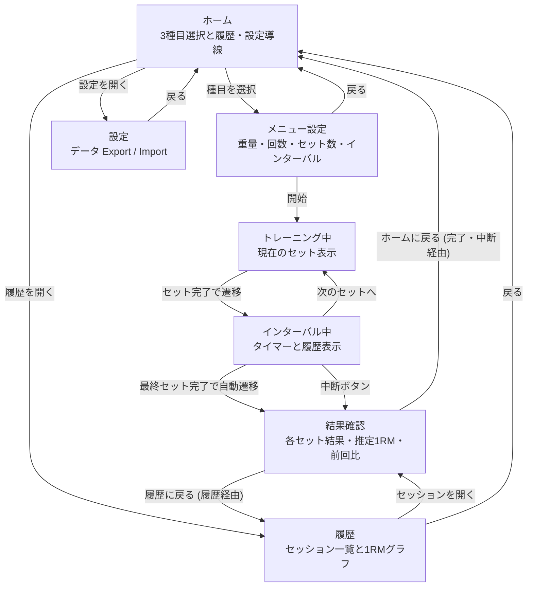
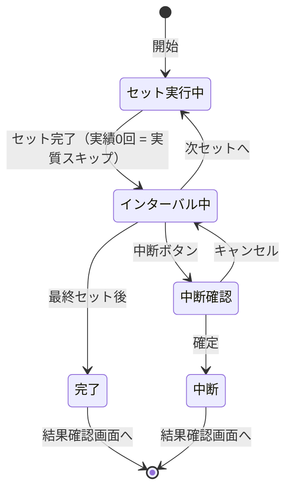

# 🏋️‍♂️ PeakRM 仕様

## 📌 概要

1RM の成長を可視化するシンプルなトレーニングアプリ。Web アプリ（PWA）として実装し、データは端末ローカル（IndexedDB）に保存する。

**想定ユーザー**: 作者本人および同じ価値観を持つ個人トレーニー。主に linear progression が機能する初心者〜中級者期間を対象とする。中上級者向けの autoregulation・ピリオダイゼーション・補助種目はスコープ外。

---

## 🎯 コンセプト

計画通りにやらせる筋トレアプリ（甘え防止）

- トレーニング前にメニューを確定する
- トレーニング中の意思決定を排除する
- 重量・メニューはトレーニング中に変更しない
- 実績のみを記録する。**セット単位の「実績」**（実績回数、ただし 0 回は「実績上スキップ」と同義）と、**セッション単位の「ステータス」**（完了 / 中断）は層が異なる概念として扱う
- 1RM の向上を目的とする

### 想定利用パターン

- **1 日に同一種目のトレーニングを行うのは原則 1 セッション**。朝晩 2 回など同日複数セッションを行うケースは想定しない。同日複数セッションが発生した場合は、履歴・グラフともに `executed` を優先して 1 件に集約する（後発の中断セッションが、同日に完遂した記録を上書きで消さないようにするため）。優先順位の詳細は「1RM グラフ」節の集約規則に従う
- ユーザーは linear progression が機能する期間（おおむね初心者〜中級者）を主な対象とする。中上級者のピリオダイゼーション（DUP・波状サイクル等）は本アプリのスコープ外

---

## 💻 対象プラットフォーム

- **形態**: Web アプリ（PWA）
- **想定環境**: モダンモバイルブラウザ（iOS Safari / Android Chrome 等）。デスクトップブラウザでも動作する
- **オフライン動作**: 対応（Service Worker による静的アセットキャッシュ）
- **Service Worker 更新戦略**: `vite-plugin-pwa` の `registerType: 'autoUpdate'`。新バージョンは次回ロード時にバックグラウンドで適用され、ユーザーへの確認ダイアログは振らない（コンセプト「意思決定排除」と整合）
- **ストレージ**: IndexedDB（端末ローカル）

ログイン / クラウド同期は実装しない。データは端末内に閉じる。

---

## 🧩 機能仕様

### 1. ホーム画面（起動時画面）

- 3 種目のボタン（ベンチプレス / スクワット / デッドリフト）
- 各ボタンには以下を表示:
  - 種目名
  - **前回セッションの記録**: 直前セッション（ステータス問わず）の重量（`KG`）と各セットの実績回数（`/` 連結、例: `8/8/7`）を `REPS` として表示。実績回数は履歴一覧と同じ `/` 連結フォーマット。同一種目で参照
  - **現状の推定 1RM**: 同じ「直前セッション」の推定 1RM 値（「1RM グラフ」節の計算式を用いる）を `kg` 単位で表示
  - 直前セッションがない場合（初回 / データクリア直後）は、推定 1RM を `—`、記録を `NO LOG` と表示
- 「履歴」への導線
- 「設定」への導線（データ Export / Import 用）
- 種目ボタンを押すとメニュー設定画面へ遷移

セッション中にタブを閉じる / リロードした場合、そこまでに完了したセットは履歴に `aborted` として残る（増分保存のため）。次回起動時はホームから新しいセッションを開始する（自動再開は行わない）。

---

### 2. メニュー設定（トレーニング前）

#### 対象種目

- ベンチプレス
- スクワット
- デッドリフト

#### 設定項目

| 項目 | 単位 | 刻み |
| --- | --- | --- |
| 重量 | kg | 0.25 |
| 回数 | 回 | 1 |
| セット数 | セット | 1 |
| インターバル | 秒 | 10 |

#### 初期値（初回起動時のみ・全種目共通）

- 重量: **40 kg**
- 回数: **8 回**
- セット数: **3 セット**
- インターバル: **90 秒**

2 回目以降は **種目ごとに最後の値を保持** し、その値を初期表示する。

**「初回起動時」の判定**: `menuPresets` テーブルに該当種目の行が存在しないこと。ブラウザデータ / IndexedDB をクリアした場合も「初回扱い」に戻る。

#### Linear progression（常時有効）

「計画通り実行」のコンセプトに時間軸を与えるため、自動増量を常時有効とする。

- **`executed` の定義**: 全セットで `actualReps ≥ menu.reps`（= 目標回数）を満たした状態でセッションが終了したとき、ステータスは `executed` となる。すなわち `executed` は常に linear progression のトリガー条件を満たす。`aborted` セッションは（その中の完了セット内訳によらず）増量トリガーの対象外
- **トリガー**: **同一種目の** 直前セッションが `executed` であること
- **増量幅**: ベンチプレス `+2.5 kg`、スクワット・デッドリフト `+5 kg`
- **ベースライン**: 増量計算は `menuPresets[exercise].weight`（直前セッションが実際に使用した重量）に対して行う。ユーザーが手動編集した値が次の `menuPresets` に保存され、それが次回のベースラインになる（編集は累積する）
- **挙動**: トリガー成立時、次回メニュー設定画面の重量初期値を上記分だけ加算して表示。ユーザーは画面上でさらに編集可能
- 失敗（target を下回るセットがあった） / 中断された場合は重量を据え置く
- **初回起動・データクリア・Import 直後**: 同一種目の直前セッションが存在しなければ増量は適用しない（初期値またはインポート値をそのまま使用）
- **プラトー対応**: 連続して据え置きが続いた場合の自動デロード提案は本仕様では実装しない。ユーザーが手動で重量を下げて再開する

#### 操作

- 「開始」ボタンで即トレーニング画面へ遷移（確認ステップなし）

#### 制約

- トレーニング中は変更不可

---

### 3. トレーニング実行（コア体験）

#### 表示

- 現在のセット情報（例: 100 kg × 8 回）
- セット進行（例: 1 / 3）
- インターバルタイマー（セット間のみ）

#### 操作

- **「セット完了」ボタン**: 該当セットを実績として記録し、インターバルタイマーを自動開始
- **実績回数**: ターゲット回数をデフォルト値とし、必要時のみ修正可。修正はステッパーで 0 以上の整数を選べる
- **実績 0 回 = 実質的なスキップ**: 専用の「スキップ」ボタンは設けない。スキップしたい場合は実績回数を 0 にして「セット完了」を押す。**確認ダイアログは振らない**（ユーザーが明示的に 0 に調整した意思として扱う）

**付随ボタン**: 中断ボタンはこの画面には置かない。セット実行中は動作に雑音を加えず「今やること」に集中させる。中断したい場合はセット完了でインターバル画面に遷移してから中断ボタンを押す（§4 参照）

#### 制約

- **重量変更不可**
- **メニュー変更不可**

上記は UI から到達できない。disabled 表現ではなく、状態モデル上で操作肢を持たないことで担保する。

#### 不変条件の実装方針

「変更不可」は UI 制御ではなく状態モデルで担保する。具体的には:

- セッション開始時に `menuPresets` の該当種目レコードを **deep copy** して `Session.menu` に焼き込む
- トレーニング画面は **`Session.menu` のみを参照** し、`menuPresets` を直接参照しない
- TypeScript 型では `Session.menu: Readonly<MenuPreset>` とし、コンパイラレベルで変更を禁止する
- セッション中に `menuPresets` を編集しても、現在の Session には影響しない（次のセッションから反映）

---

### 4. インターバルタイマー（セット間）

トレーニング画面表示中は [Screen Wake Lock API](https://developer.mozilla.org/en-US/docs/Web/API/Screen_Wake_Lock_API) で画面スリープを防ぐ。これにより iOS Safari でも背景化を伴わずタイマー音を鳴らせる。Wake Lock 取得失敗時もタイマー機能自体は動作する（最善努力）。

**Wake Lock のライフサイクル**:
- **取得**: メニュー設定画面の「開始」ボタンタップ時（AudioContext の初期化と同じユーザージェスチャ内）
- **解除**: 結果確認画面へ遷移したタイミングで `release()` を呼ぶ
- タブが背景化されるとブラウザが自動 release する。前景復帰時の再取得は行わない（最善努力）

**AudioContext の初期化**: iOS Safari はユーザージェスチャ内でしか AudioContext の resume を許可しない。メニュー設定画面の「開始」ボタンタップ時（=トレーニング画面への遷移トリガー）に `AudioContext` を生成・`resume()` し、初回タイマー 0 秒到達時に確実に音を鳴らせる状態にする。

- セット完了で **自動開始**
- 値は事前設定のインターバル値を使用
- **手動停止可能**
- **「中断」ボタン**（控えめに配置）: ここまでの記録を保存して結果確認画面へ遷移。**確認ダイアログ** を振る。中断ボタンはこの画面（インターバル中）にのみ配置する
- 0 秒到達時は **音のみで通知**
  - バイブレーション、画面遷移、ボタンハイライト等は行わない
  - **「次のセットへ」ボタンはタイマー中でも押せる（中断も同様）
- 0 秒到達後もカウントは止めず、**超過秒数を `+12` のように表示** する
  - 「どれだけ余分に休んだか」を可視化するための **受動的な表示** であり、操作（延長ボタン等）は加えない
  - これによりトレーニング中に新たな意思決定を発生させない方針を保つ
  - **上限**: 超過表示は `+180` 秒（3 分）で頭打ちとし、それ以降はカウントを進めず `+180` のまま固定表示する

**完了済みセットの実績回数編集**: 履歴タイムラインに表示される各完了セットの実績回数はステッパーで調整できる。「セット中はカウントを間違えた」ケースをインターバル中に訂正できるようにするため。詳細は§3 「実績値の編集ポリシー」参照

---

### 5. セッション実行 / 中断

#### 自動実行完了

- 最終セット完了で自動的にセッションを保存し、**結果確認画面** へ遷移
- セッションのステータス: `executed`

#### 中断

- 「中断」ボタンでここまでの記録を保存し、同じ結果確認画面へ遷移
- セッションのステータス: `aborted`

#### 結果確認画面

実行・中断のいずれでも同一画面を表示する。

- 種目名 / ステータス（実行 or 中断）
- 各セットの結果一覧（重量・ターゲット回数 / 実績回数・**メモ**。実績 0 回は「スキップ」として示す）
- その日の推定 1RM（後述の種目別式で算出した最大値）。実績回数をこの画面で編集した場合は再計算して反映させる
- **実績回数の編集**: 各セットの実績回数をステッパーで調整できる（履歴一覧から開いた履歴詳細表示中は読み専用）。詳細は§3 「実績値の編集ポリシー」参照
- 前回トレーニング時（同種目で直前の **`executed`** セッション）の推定 1RM からの差分。前回データがなければ表示しない（`aborted` セッションは比較対象外）
- **次回の重量プレビュー**: linear progression のトリガーが成立していれば「次回 +2.5 kg」または「次回 +5 kg」を表示する。**不成立時は何も表示しない**（増量時のみのポジティブな通知に絞り、据え置きを「失敗」と感じさせない）。**履歴一覧から開いた場合は常に非表示**（過去のセッションに「次回」は存在しないため）
- **メモの表示・編集**: 実績できたセットまたは実績 0 回（スキップ相当）のセットについて、該当セットの下にメモを表示し、同画面上で編集もできる。未実施セットはメモの対象外。詳細は「セットメモ」節参照
- 戻る導線: 遷移元によって動的に切り替え。
  - **トレーニング終了・中断経由**: 画面下部の **「トレーニング終了」** ボタンでホームへ（実行・中断を包含する中立なラベルとして「終了」を採用）。ヘッダーに戻る矢印は置かない（メインの導線をボタンに集約）
  - **履歴一覧から開いた**: ヘッダー左上の **「←」** で履歴へ戻る。下部にボタンは置かない（戻り導線を1か所に絞る）
  - ブラウザ / OS の戻る操作も同じ遷移先に揃える
- **セッション削除（履歴詳細経由でのみ）**: 履歴一覧から開いた場合のみ、ヘッダー右上に削除（ゴミ箱）アクションを表示する。完了・中断直後の結果確認画面には**表示しない**（やり終えた直後に「なかったことにする」導線を出さないため）
  - **破壊的操作のため確認ダイアログを振る**。承認時に当該セッションを `sessions` テーブルから `id` で 1 件削除し、履歴一覧へ戻る
  - 削除対象は当該 `Session` のみ。`menuPresets` には影響しない
  - **副作用**: 削除したセッションは 1RM グラフのデータ点から外れる。linear progression が参照する「同一種目の直前セッション」も変わりうる（直近を削除すると 1 つ前が直前セッションになる）。増量ベースライン自体は `menuPresets[exercise].weight` に保持されるため失われない

---

### 5.5 セットメモ

セットごとに自由記述のメモを残せる。「出来を実績以外に残したい」ケース（フォームの感覚、身体の調子、補助者の有無など）をカバーする。

#### 仕様

- **スコープ**: `SetResult` に付随するフィールド（セッション単位ではなくセット単位）
- **型**: 自由記述のテキスト。**文字数上限は設けない**
- **初期値**: 空文字列 `""`。「メモなし」と同義
- **対象セット**:
  - セット完了済み（`actualReps ≥ 1`）のセット: 記述可
  - 実績 0 回のセット（`actualReps === 0` / 実質的なスキップ）: 記述可（「このセットをスキップした理由」を残せるため）
  - **未実施のセット**（中断により `results[]` に記録がないセット）: **記述不可**

#### 入力・編集タイミング

メモは以下の画面で入力・編集できる:

- **トレーニング中（インターバル画面）**: 直前に完了したセットにメモを残せる
- **結果確認画面**: 各セットのメモを表示し、同画面で編集できる
- **履歴詳細画面**: 過去のセッションを開いた際も同様に編集可能

**セット実行画面ではメモを表示・入力させない**。「今やること」に集中させるため、メモ描画・編集 UI はインターバル画面以降に限定する。

#### 不変性の例外

仕様上の「トレーニング中の重量・メニュー変更不可」制約は **実績値・ターゲット値に限定される**。メモは実績値ではなく記録の注釈であるため、**いつでも編集可能**とする（セッション中・完了後・履歴画面上、いずれも可）。

#### 履歴一覧での扱い

履歴一覧ではメモを表示しない（メモ有無のドットなども含めて、一覧の視認性を保つため）。詳細・編集はセッションを開いた詳細画面で行う。

---

### 6. 履歴

- 過去のセッション一覧（日付降順）
- セッションを開くと結果確認画面と同じ詳細を表示（セットメモもこの画面で閲覧・編集できる）。**ただし実績回数は読み専用**（§3 「実績値の編集ポリシー」参照）
- 履歴詳細では当該セッションを削除できる（§5「結果確認画面」のセッション削除を参照）。**一覧画面から直接の削除導線は設けない**（削除は詳細を開いた上での明示操作に限定）
- **同一日・同一種目のセッションが複数ある場合は 1 件のみ** を一覧に表示する。採用ルールは「1RM グラフ」節の集約規則（`executed` 優先 → 推定 1RM 最大 → `startedAt` 最大）に従い、履歴・グラフで揃える
- **「同一日」の判定**: デバイスのローカルタイムゾーン基準

---

### 7. データ Export / Import（設定画面）

データの端末買い替え・ブラウザクリア・iOS Safari ITP（7 日不使用で自動退避）対策として、最小機能のバックアップ手段を提供する。クラウド同期ではなく、ユーザー操作によるファイル経由のデータ移行。

**設定画面のスコープ**: データ操作（Export / Import）のみを置く。インターバル既定値・linear progression on/off・増量幅などのトレーニング挙動を変える設定は、ここに追加しない（コア体験「意思決定排除」を守るため）。

- **Export**: 設定画面の「Export」ボタンで、`sessions` と `menuPresets` の全データを 1 つの JSON ファイルとしてダウンロード
  - フォーマット: `{ schemaVersion: 1, exportedAt: <unix ms>, sessions: [...], menuPresets: [...] }`
  - ファイル名: `peak-rm-export-YYYY-MM-DD.json`
- **Import**: 設定画面の「Import」ボタンで JSON ファイルを選択
  - 全データを 1 トランザクションで置換（atomic）。検証失敗時は既存データを変更しない
  - 検証内容: `schemaVersion` 一致、必須フィールドの存在、enum 値の妥当性
  - 検証エラー時はエラー内容を表示して中断、既存データは保持
  - 検証成功後、確認ダイアログで「X 件のセッション、Y 件のプリセットを置き換えます」と表示。ユーザー確認後に置換実行

> **将来課題（v1 期間中はスコープ外）**: `schemaVersion` が将来 v2 以降に更新された場合の、旧バージョン Export ファイルの取り扱い（自動マイグレーション / 明示的拒否のいずれにするか）は別途仕様化する。v1 期間中は `schemaVersion` 完全一致のみ受け入れ、それ以外は検証エラーとして拒否する。

加えて、ITP 自動退避を軽減するためアプリ初回起動時に `navigator.storage.persist()` を要求する。許可は最善努力で、拒否された場合もアプリ機能には影響しない。

---

### 8. 1RM グラフ

#### 計算式（種目別）

[FWJ「RM 換算表」](https://fwj.jp/magazine/rm/) の換算式を採用する。`w` を実施重量（kg）、`r` を実績回数とする。

- **ベンチプレス**: `1RM = w × r / 40 + w` = `w × (1 + r / 40)`
- **スクワット**: `1RM = w × r / 33.3 + w` = `w × (1 + r / 33.3)`
- **デッドリフト**: `1RM = w × r / 33.3 + w` = `w × (1 + r / 33.3)`

式は **1〜12 回** の範囲で精度が確保される（FWJ 換算表の有効レンジ）。それを超える高 rep の入力は受け付けるが、推定値の妥当性は低下する（仕様としては許容）。

#### データルール

- 1 セッション内の **実績回数 ≥ 1 のセット** ごとに上記式で 1RM 相当値を算出し、その日の **最大値** を採用
- 実績 0 回のセットは計算対象から **除外**
- 中断したセッションも、中断までに実施したセットがあれば計算対象に含める
- 日付ごとに 1 点。同日に複数セッションがある場合は次の優先順位で 1 件を採用する（この集約規則は履歴一覧でも共通して用いる）:
  1. `executed` セッションがあれば、その中で**推定 1RM が最大**のもの（PeakRM はピーク強度を追跡するため、最新ではなくベスト記録を採用する）
  2. `executed` が 1 件も無ければ `aborted` の中で同様に**推定 1RM が最大**のもの
  3. 1RM も同値の場合は最新（`startedAt` 最大）を採用する（決定論のための最終 tie-break）

  原則として同日に同一種目で複数セッションを行うケースは想定していない（ホーム画面セクション参照）。本ルールは万一発生した場合の決定論的な扱いを定めるためのもの

#### 表示仕様

- 横軸: 日付
- 縦軸: 1RM（kg）
- 折れ線グラフ
- 種目別に表示（タブで切り替え）

---

## 📐 画面遷移

### 画面全体



### トレーニング画面内部の状態



---

## 🗃️ データモデル

実装言語は TypeScript。型定義はおおよそ次の通り。

```ts
type Exercise = 'benchPress' | 'squat' | 'deadlift'

type MenuPreset = {
  exercise: Exercise
  weight: number      // kg, 0.25 刻み
  reps: number        // 回
  sets: number        // セット数
  intervalSec: number // 秒, 10 刻み
}

type SetResult = {
  actualReps: number      // 0 以上の整数。`actualReps === 0` は実質的なスキップと同義
  memo: string            // ユーザー記述のメモ。初期値 ""、文字数上限なし。不変性の対象外
}
// セットの順序は results 配列のインデックスで表す（append only・並び替えなし）

type Session = {
  id: string
  exercise: Exercise
  status: 'executed' | 'aborted'
  startedAt: number       // unix ms
  menu: Readonly<MenuPreset>  // セッション開始時点の deep copy。以降の menuPresets 変更は反映しない
  results: SetResult[]
}

// FWJ 換算式 1RM = w × (1 + r / divisor) の種目別 divisor
const ONE_RM_DIVISOR: Record<Exercise, number> = {
  benchPress: 40,
  squat: 33.3,
  deadlift: 33.3,
}

function estimateOneRm(exercise: Exercise, weight: number, reps: number): number {
  if (reps < 1) return 0
  return weight * (1 + reps / ONE_RM_DIVISOR[exercise])
}
```

---

## 💾 ストレージ

- **実装**: IndexedDB（[Dexie.js](https://dexie.org/) 経由）
- **テーブル設計**:
  - `sessions`: `Session` をそのまま保存。主キー `id`、`startedAt` 単独インデックス（全件降順一覧用）、`[exercise+startedAt]` 複合インデックス（同種目の直前 1 件を末尾取得用）
  - `menuPresets`: `Exercise` をキーに最後の `MenuPreset` を保存（次回の初期表示用）
- **永続化のタイミング**: セッション開始時に `status = 'aborted'`（保守的なデフォルト）で 1 回 insert する。セット完了ごとに `results` を増分 update。最終セット完了時に `status = 'executed'` へ更新、中断ボタン時はそのまま `aborted` で確定。タブクローズ / クラッシュ / SW autoUpdate 経由のリロードでも、それまでの実績は `aborted` セッションとして履歴に残る
- **スキーマバージョン**: 初版は v1。スキーマ変更時は Dexie の `version()` チェーンで明示的にマイグレーションを宣言する

---

## 🎨 デザイン

- 画面のビジュアルデザインは **Claude Design** で作成する
- そのため、本仕様書に記載している **画面構成・画面遷移・UI 要素の配置** は、デザイン作成過程で **変更される可能性がある**
- 一方、機能仕様（操作の振る舞い・制約）、データモデル、1RM 計算式、ストレージ設計などのコア仕様は、デザイン変更に左右されない

### トーンガイド（コンセプト保護のための禁止・推奨事項）

「甘え防止」「実績のみ記録」のコンセプトを保つため、ビジュアル / コピーの方向性を以下に固定する。

- **禁止**: 祝祭アニメーション（紙吹雪・Confetti） / streak ゲーミフィケーション / onboarding carousel / カウントダウンの ring 装飾 / 親密 / フレンドリーな絵文字多用
- **トーン**: 事実ベースの状態表記を基本とする（"Session executed!" "Linear progression triggered" など）。賞賛コピー（"Great job!" など）は禁止しないが、デフォルトは事実ベース。感嘆符は状態の確定や強調を伝える範囲で使用可
- **推奨**: タイポグラフィ主導の情報設計、装飾・イラストは最小限、結果は中立的な事実提示（中断セッションを「失敗」と扱わず単にステータスとして表示）
- **コピー**: 動詞優先・無感情。「セット完了」「中断」など事実だけを述べる短い文言を使う
- **配色**: 高コントラスト・グレースケール寄り。色は強度の区別（次セット待ちか実行中か）のみに使う

---

## 📱 画面構成

| 画面 | 内容 |
| --- | --- |
| ホーム | 3 種目選択 + 履歴・設定への導線 |
| メニュー設定 | 重量 / 回数 / セット数 / インターバルの設定 + 「開始」 |
| トレーニング中 | 現在のセット表示・「セット完了」（実績回数ステッパー付き） |
| インターバル中 | タイマー・履歴タイムライン・メモ入力・「次のセットへ」「中断」 |
| 結果確認 | 実行 / 中断後のサマリ + 1RM 差分 |
| 履歴 | セッション一覧・1RM 推移グラフ |
| 設定 | データ Export / Import |

---

## 🧱 技術スタック

| 区分 | 採用 |
| --- | --- |
| フレームワーク | Vue 3 + Vite + TypeScript（Composition API + `<script setup>`） |
| スタイリング | scoped CSS（Tailwind なし） |
| グラフ | vue-chartjs（Chart.js ベース） |
| ストレージ | IndexedDB（Dexie.js） |
| PWA | vite-plugin-pwa（インストール可能・オフライン対応） |
| コンポーネント開発 | Storybook（Vue 3 + Vite） |
| テスト | Vitest projects（ロジックは `happy-dom`、Story の play 関数は `@storybook/addon-vitest` + headless Chromium。すべて Vitest で実行） |
| Lint / Format | ESLint + Prettier |
| Git hooks | husky + lint-staged（pre-commit で lint-staged → typecheck → test） |

### テスト方針

- **ロジック層**（1RM 計算、`menuPresets` / `sessions` の保存・更新、その他 composable のビジネスロジック）は **Vitest**（`unit` project、`happy-dom`）で単体テスト
- **コンポーネント層**（メニュー設定フォーム、トレーニング画面のセット表示、タイマー UI など）は **Storybook** に Story を書き、`play` 関数でクリック・入力などのインタラクションテストを記述。play 関数は **`@storybook/addon-vitest` + Vitest browser mode（headless Chromium / Playwright）** で実行する（`storybook` project）
- 実ブラウザ・実描画に依存する視覚検証は **Chromatic**（visual regression）が担う
- ロジックと Story は役割で分担し、同じ振る舞いを両方では書かない

---

## 🚀 デプロイ・公開

### 本体アプリ

- **ホスティング**: [Cloudflare Pages](https://pages.cloudflare.com/)（無料枠で帯域無制限・商用利用制限なし）
- **公開 URL**: Cloudflare Pages のデフォルトサブドメイン（例: `peak-rm.pages.dev`）。独自ドメインは設定しない
- **デプロイトリガー**: `main` ブランチへの push で自動ビルド・デプロイ（GitHub 連携）
- **ビルド設定**:
  - ビルドコマンド: `npm run build`
  - 出力ディレクトリ: `dist`
- **PR プレビュー**: feature ブランチ / PR ごとに一時 URL が自動発行される
- **HTTPS**: Cloudflare が自動付与（PWA 動作の前提）

### Storybook（コンポーネントカタログ）

- **ホスティング**: [Chromatic](https://www.chromatic.com/)（Storybook 公式の公開サービス、無料枠 5,000 snapshot/月）
- **公開 URL**: Chromatic 発行のプロジェクト URL
- **検索エンジン**: Chromatic は公開 Storybook に **`noindex`** を付与しデフォルトで検索エンジンに登録されない。クローラには非表示、URL を知る人だけが閲覧できる
- **デプロイトリガー**: `main` ブランチへの push で `npx chromatic` を CI 実行（GitHub Actions）。PR ごとのプレビュー公開は行わない
- **副次的メリット**: ビジュアルリグレッションテストが付録で得られる（差分検知）

#### Snapshot 節約の運用方針（無料枠内に収める）

Chromatic の snapshot は「story 数 × viewport 数 × ブラウザ数 × ビルド回数」で消費される。無料枠 5,000/月に収めるため次を遵守する。

1. **TurboSnap を有効化**: 変更があった story（依存ファイル経由で影響を受けた story を含む）のみ snapshot 対象とする Chromatic の機能を使う
2. **viewport は 1 つだけ**: モバイル前提、例: 390px width
3. **ブラウザは 1 つだけ**: Chrome のみ（Chromatic デフォルト）
4. **視覚差分として価値のない story は snapshot 対象外**: 既存 variant と見た目が重複する story（`play` 検証用の `Behavior` story など）に `parameters: { chromatic: { disableSnapshot: true } }` を付け、実機 UI として価値ある代表状態のみ snapshot 取得。引数を動かすだけの探索用 story は作らない（Controls はどの story でも使えるため `Default` で足りる）
5. **CI トリガーは `main` push のみ**: PR や feature ブランチでは Chromatic を起動しない
6. **緊急レバー**: 想定を超えて消費が早ければ、main push 毎 → 週次バッチ / リリースタグ時のみ実行に切り替える

---

## 🚫 実装しない機能

- ログイン / クラウド同期
- 種目追加
- 詳細分析（達成率、ボリューム推移、RIR 推定など）
- 複雑な設定項目
- **PWA インストールを促す UI**（`beforeinstallprompt` を捕捉したカスタムバナー、ホーム画面追加の案内など）。ブラウザのデフォルト動作のみとする（「意思決定排除」コンセプトと整合）

---

## 💡 設計方針

- 入力ではなく「実行」にフォーカス
- 操作ステップを最小化
- **トレーニング画面に確認ダイアログを持ち込まない**。例外: 中断はインターバル画面で破壊的操作のため確認を許容する
- 重量・メニュー変更不可は UI 制御ではなく **状態モデル上の不変条件** として表現する。この不変性の対象は **セッションのメニュー（重量・ターゲット回数・セット数・インターバル）** に限定される。実績値（actualReps）とセットメモは不変性の例外として一部画面で編集可能とする（下記「実績値の編集ポリシー」・§5.5 セットメモ参照）
- シンプルさを最優先

**セット編集モーダル**: 実績回数とセットメモの編集は、各完了セットの **カード全体（インターバル中）または ✎ アイコン（結果確認）** をタップしてモーダルを開いて行う。モーダル内容: 重量（読み専用）・実績回数（ステッパー）・メモ。**「保存」ボタン** で値を確定して閉じ、確認ダイアログは振らない。閉じる用の × ボタンは置かない（メインの導線をボタンに集約）。カード内にステッパーを常設しないことでログ一覧の可読性を保つ。メモ未入力のセットは、インターバル中画面では「メモを追加」と表示してタップを促す。結果確認・履歴詳細では未入力時の行は表示しない。

### 実績値の編集ポリシー

`actualReps`（実績回数）は「トレーニング中に一度記録したら二度と變えられない」という厚い不変性を課さず、「やっている途中は訂正できる」設計とする。具体的に:

| 画面 | 編集可否 |
| --- | --- |
| トレーニング中（現セット） | 可（ステッパーでセット完了前に調整） |
| インターバル中（完了済みセット） | 可 |
| 結果確認画面（そのセッション終了直後） | 可 |
| 履歴詳細画面（過去のセッション） | **不可（読み専用）** |

履歴を読み専用にする意図: 過去のセッションにはすでに 1RM グラフや linear progression のトリガー判定が適用されており、遡及的な変更を許すとトレーニング史全体の一貫性が崩れるため。

**編集に伴う `status` の再導出**: 実績回数を編集した場合、`Session.status` は編集後の `results` に対する `isExecuted` 判定から再導出する（全セット目標達成⇄未達の変更が `executed` / `aborted` に追従する）。これにより「`status` は `executed` だが `results` は未達」という不整合を防ぐ。増量トリガーは `isExecuted` で再判定されるため安全だが、同日集約（`executed` 優先）が `status` を参照するため整合を保つ必要がある。

**実装記**: TypeScript 型上、`Session.results: SetResult[]` はトレーニング中・結果確認中は可変、履歴詳細表示中は `Readonly<SetResult>[]` として扱う（画面コンテクストで読み専用を採用し、入力 UI も表示しない）。

---

## 🎯 一言まとめ

**決めたメニューをブレずに実行し、1RM の成長を可視化するアプリ**
