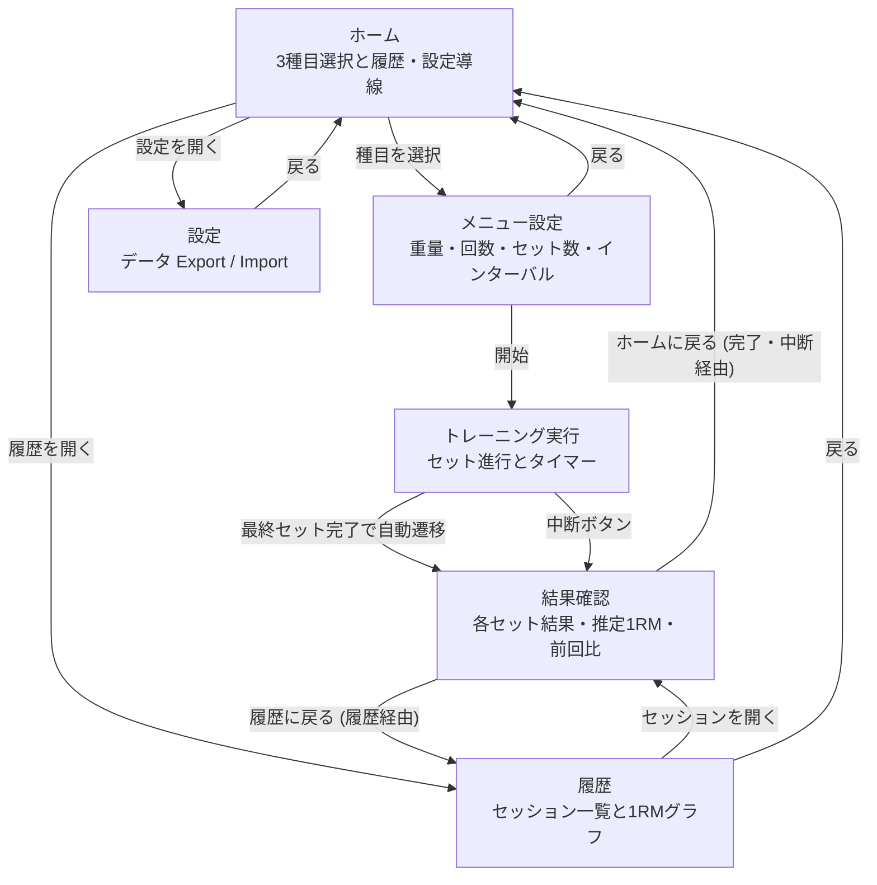
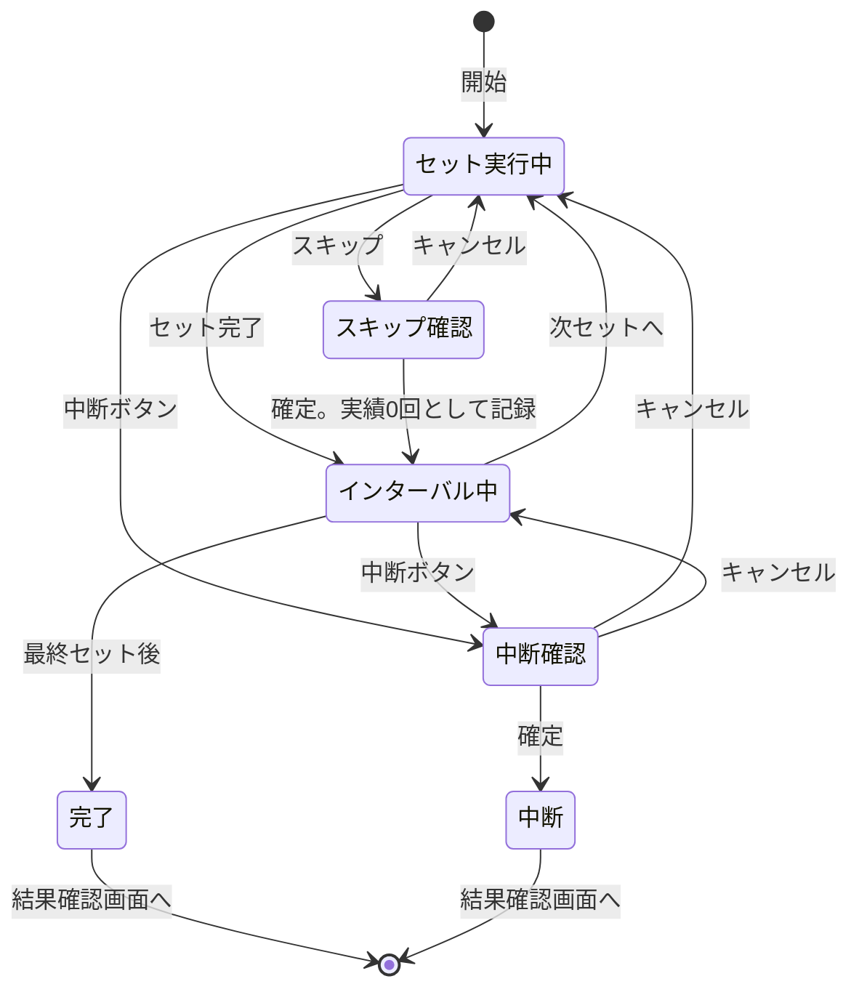

# 🏋️‍♂️ PeakRM 仕様

## 📌 概要

1RM の成長を可視化するシンプルなトレーニングアプリ。Web アプリ（PWA）として実装し、データは端末ローカル（IndexedDB）に保存する。

**想定ユーザー**: 作者本人および同じ価値観を持つ個人トレーニー。主に linear progression が機能する初心者〜中級者期間を対象とする。中上級者向けの autoregulation・ピリオダイゼーション・補助種目はスコープ外。

---

## 🎯 コンセプト

計画通りにやらせる筋トレアプリ（甘え防止）

- トレーニング前にメニューを確定する
- トレーニング中の意思決定を排除する
- 重量・メニューはトレーニング中に変更しない
- 実績のみを記録する。**セット単位の「実績」**（実績回数 / スキップフラグ）と、**セッション単位の「ステータス」**（完了 / 中断）は層が異なる概念として扱う
- 1RM の向上を目的とする

### 想定利用パターン

- **1 日に同一種目のトレーニングを行うのは原則 1 セッション**。朝晩 2 回など同日複数セッションを行うケースは想定しない。同日複数セッションが発生した場合は、仕様の単純化のため履歴・グラフともに最新セッションで上書きする
- ユーザーは linear progression が機能する期間（おおむね初心者〜中級者）を主な対象とする。中上級者のピリオダイゼーション（DUP・波状サイクル等）は本アプリのスコープ外

---

## 💻 対象プラットフォーム

- **形態**: Web アプリ（PWA）
- **想定環境**: モダンモバイルブラウザ（iOS Safari / Android Chrome 等）。デスクトップブラウザでも動作する
- **オフライン動作**: 対応（Service Worker による静的アセットキャッシュ）
- **Service Worker 更新戦略**: `vite-plugin-pwa` の `registerType: 'autoUpdate'`。新バージョンは次回ロード時にバックグラウンドで適用され、ユーザーへの確認ダイアログは振らない（コンセプト「意思決定排除」と整合）
- **ストレージ**: IndexedDB（端末ローカル）

ログイン / クラウド同期は実装しない。データは端末内に閉じる。

---

## 🧩 機能仕様

### 1. ホーム画面（起動時画面）

- 3 種目のボタン（ベンチプレス / スクワット / デッドリフト）
- 「履歴」への導線
- 「設定」への導線（データ Export / Import 用）
- 種目ボタンを押すとメニュー設定画面へ遷移

セッション中にタブを閉じる / リロードした場合、そこまでに完了したセットは履歴に `aborted` として残る（増分保存のため）。次回起動時はホームから新しいセッションを開始する（自動再開は行わない）。

---

### 2. メニュー設定（トレーニング前）

#### 対象種目

- ベンチプレス
- スクワット
- デッドリフト

#### 設定項目

| 項目 | 単位 | 刻み |
| --- | --- | --- |
| 重量 | kg | 0.25 |
| 回数 | 回 | 1 |
| セット数 | セット | 1 |
| インターバル | 秒 | 10 |

#### 初期値（初回起動時のみ・全種目共通）

- 重量: **40 kg**
- 回数: **8 回**
- セット数: **3 セット**
- インターバル: **90 秒**

2 回目以降は **種目ごとに最後の値を保持** し、その値を初期表示する。

**「初回起動時」の判定**: `menu_presets` テーブルに該当種目の行が存在しないこと。ブラウザデータ / IndexedDB をクリアした場合も「初回扱い」に戻る。

#### Linear progression（常時有効）

「計画通り実行」のコンセプトに時間軸を与えるため、自動増量を常時有効とする。

- **トリガー**: **同一種目の** 直前セッションが `completed` かつ全セットで `actualReps ≥ targetReps` を満たしたとき
- **増量幅**: ベンチプレス `+2.5 kg`、スクワット・デッドリフト `+5 kg`
- **ベースライン**: 増量計算は `menu_presets[exercise].weight`（直前セッションが実際に使用した重量）に対して行う。ユーザーが手動編集した値が次の `menu_presets` に保存され、それが次回のベースラインになる（編集は累積する）
- **挙動**: トリガー成立時、次回メニュー設定画面の重量初期値を上記分だけ加算して表示。ユーザーは画面上でさらに編集可能
- 失敗（target を下回るセットがあった） / 中断された場合は重量を据え置く
- **初回起動・データクリア・Import 直後**: 同一種目の直前セッションが存在しなければ増量は適用しない（初期値またはインポート値をそのまま使用）
- **プラトー対応**: 連続して据え置きが続いた場合の自動デロード提案は本仕様では実装しない。ユーザーが手動で重量を下げて再開する

#### 操作

- 「開始」ボタンで即トレーニング画面へ遷移（確認ステップなし）

#### 制約

- トレーニング中は変更不可

---

### 3. トレーニング実行（コア体験）

#### 表示

- 現在のセット情報（例: 100 kg × 8 回）
- セット進行（例: 1 / 3）
- インターバルタイマー（セット間のみ）

#### 操作

- **「セット完了」ボタン**: 該当セットを実績として記録し、インターバルタイマーを自動開始
- **実績回数**: ターゲット回数をデフォルト値とし、必要時のみ修正可
- **「スキップ」ボタン**（控えめに配置）: 該当セットを「実績 0 回」として記録。**確認ダイアログ** を振る
- **「中断」ボタン**（控えめに配置）: ここまでの記録を保存して結果確認画面へ遷移。**確認ダイアログ** を振る（破壊的操作のため Skip と同じ基準）

#### 制約

- **重量変更不可**
- **メニュー変更不可**

上記は UI から到達できない。disabled 表現ではなく、状態モデル上で操作肢を持たないことで担保する。

#### 不変条件の実装方針

「変更不可」は UI 制御ではなく状態モデルで担保する。具体的には:

- セッション開始時に `menu_presets` の該当種目レコードを **deep copy** して `Session.menu` に焼き込む
- トレーニング画面は **`Session.menu` のみを参照** し、`menu_presets` を直接参照しない
- TypeScript 型では `Session.menu: Readonly<MenuPreset>` とし、コンパイラレベルで変更を禁止する
- セッション中に `menu_presets` を編集しても、現在の Session には影響しない（次のセッションから反映）

---

### 4. インターバルタイマー（セット間）

トレーニング画面表示中は [Screen Wake Lock API](https://developer.mozilla.org/en-US/docs/Web/API/Screen_Wake_Lock_API) で画面スリープを防ぐ。これにより iOS Safari でも背景化を伴わずタイマー音を鳴らせる。Wake Lock 取得失敗時もタイマー機能自体は動作する（最善努力）。

**AudioContext の初期化**: iOS Safari はユーザージェスチャ内でしか AudioContext の resume を許可しない。メニュー設定画面の「開始」ボタンタップ時（=トレーニング画面への遷移トリガー）に `AudioContext` を生成・`resume()` し、初回タイマー 0 秒到達時に確実に音を鳴らせる状態にする。

- セット完了で **自動開始**
- 値は事前設定のインターバル値を使用
- **手動停止可能**
- 0 秒到達時は **音のみで通知**
  - バイブレーション、画面遷移、ボタンハイライト等は行わない
  - 「セット完了」ボタンはタイマー中でも押せる
- 0 秒到達後もカウントは止めず、**超過秒数を `+12` のように表示** する
  - 「どれだけ余分に休んだか」を可視化するための **受動的な表示** であり、操作（延長ボタン等）は加えない
  - これによりトレーニング中に新たな意思決定を発生させない方針を保つ

---

### 5. セッション完了 / 中断

#### 自動完了

- 最終セット完了で自動的にセッションを保存し、**結果確認画面** へ遷移
- セッションのステータス: `completed`

#### 中断

- 「中断」ボタンでここまでの記録を保存し、同じ結果確認画面へ遷移
- セッションのステータス: `aborted`

#### 結果確認画面

完了・中断のいずれでも同一画面を表示する。

- 種目名 / ステータス（完了 or 中断）
- 各セットの結果一覧（重量・ターゲット回数 / 実績回数・スキップ表示）
- その日の推定 1RM（後述の種目別式で算出した最大値）
- 前回トレーニング時（同種目で直前のセッション、ステータス問わず）の推定 1RM からの差分。前回データがなければ表示しない
- **次回の重量プレビュー**: linear progression のトリガーが成立していれば「次回 +2.5 kg」または「次回 +5 kg」、不成立なら「重量据え置き」と中立に表示
- 戻るボタン: 遷移元によって動的に切り替え。トレーニング完了・中断経由なら「ホームに戻る」、履歴一覧から開いたなら「履歴に戻る」。ブラウザ / OS の戻る操作も同じ遷移先に揃える

---

### 6. 履歴

- 過去のセッション一覧（日付降順）
- セッションを開くと結果確認画面と同じ詳細を表示
- **同一日・同一種目のセッションが複数ある場合は、最新の 1 件のみ** を一覧に表示（後で行われた記録で表示上書き）
- **「同一日」の判定**: デバイスのローカルタイムゾーン基準

---

### 7. データ Export / Import（設定画面）

データの端末買い替え・ブラウザクリア・iOS Safari ITP（7 日不使用で自動退避）対策として、最小機能のバックアップ手段を提供する。クラウド同期ではなく、ユーザー操作によるファイル経由のデータ移行。

**設定画面のスコープ**: データ操作（Export / Import）のみを置く。インターバル既定値・linear progression on/off・増量幅などのトレーニング挙動を変える設定は、ここに追加しない（コア体験「意思決定排除」を守るため）。

- **Export**: 設定画面の「Export」ボタンで、`sessions` と `menu_presets` の全データを 1 つの JSON ファイルとしてダウンロード
  - フォーマット: `{ schemaVersion: 1, exportedAt: <unix ms>, sessions: [...], menuPresets: [...] }`
  - ファイル名: `peak-rm-export-YYYY-MM-DD.json`
- **Import**: 設定画面の「Import」ボタンで JSON ファイルを選択
  - 全データを 1 トランザクションで置換（atomic）。検証失敗時は既存データを変更しない
  - 検証内容: `schemaVersion` 一致、必須フィールドの存在、enum 値の妥当性
  - 検証エラー時はエラー内容を表示して中断、既存データは保持
  - 検証成功後、確認ダイアログで「X 件のセッション、Y 件のプリセットを置き換えます」と表示。ユーザー確認後に置換実行

加えて、ITP 自動退避を軽減するためアプリ初回起動時に `navigator.storage.persist()` を要求する。許可は最善努力で、拒否された場合もアプリ機能には影響しない。

---

### 8. 1RM グラフ

#### 計算式（種目別）

[FWJ「RM 換算表」](https://fwj.jp/magazine/rm/) の換算式を採用する。`w` を実施重量（kg）、`r` を実績回数とする。

- **ベンチプレス**: `1RM = w × r / 40 + w` = `w × (1 + r / 40)`
- **スクワット**: `1RM = w × r / 33.3 + w` = `w × (1 + r / 33.3)`
- **デッドリフト**: `1RM = w × r / 33.3 + w` = `w × (1 + r / 33.3)`

式は **1〜12 回** の範囲で精度が確保される（FWJ 換算表の有効レンジ）。それを超える高 rep の入力は受け付けるが、推定値の妥当性は低下する（仕様としては許容）。

#### データルール

- 1 セッション内の **実績回数 ≥ 1 のセット** ごとに上記式で 1RM 相当値を算出し、その日の **最大値** を採用
- スキップしたセット（実績 0 回）は計算対象から **除外**
- 中断したセッションも、中断までに実施したセットがあれば計算対象に含める
- 日付ごとに 1 点。同日に複数セッションがある場合は **最後のセッションで上書き**

#### 表示仕様

- 横軸: 日付
- 縦軸: 1RM（kg）
- 折れ線グラフ
- 種目別に表示（タブで切り替え）

---

## 📐 画面遷移

### 画面全体



### トレーニング画面内部の状態



---

## 🗃️ データモデル

実装言語は TypeScript。型定義はおおよそ次の通り。

```ts
type Exercise = 'bench' | 'squat' | 'deadlift'

type MenuPreset = {
  exercise: Exercise
  weight: number      // kg, 0.25 刻み
  reps: number        // 回
  sets: number        // セット数
  intervalSec: number // 秒, 10 刻み
}

type SetResult = {
  setIndex: number        // 0-based
  targetReps: number
  actualReps: number      // skip 時は 0
  skipped: boolean
  completedAt: number     // unix ms
}

type Session = {
  id: string
  exercise: Exercise
  status: 'completed' | 'aborted'
  startedAt: number       // unix ms
  endedAt: number         // unix ms
  menu: Readonly<MenuPreset>  // セッション開始時点の deep copy。以降の menu_presets 変更は反映しない
  results: SetResult[]
}

function estimate1RM(exercise: Exercise, weight: number, reps: number): number {
  if (reps < 1) return 0
  switch (exercise) {
    case 'bench':
      return weight * (1 + reps / 40)
    case 'squat':
    case 'deadlift':
      return weight * (1 + reps / 33.3)
    default: {
      const _exhaustive: never = exercise
      throw new Error(`Unknown exercise: ${_exhaustive}`)
    }
  }
}
```

---

## 💾 ストレージ

- **実装**: IndexedDB（[Dexie.js](https://dexie.org/) 経由）
- **テーブル設計**:
  - `sessions`: `Session` をそのまま保存。主キー `id`、`exercise` と `startedAt` にインデックス
  - `menu_presets`: `Exercise` をキーに最後の `MenuPreset` を保存（次回の初期表示用）
- **永続化のタイミング**: セッション開始時に `status = 'aborted'`（保守的なデフォルト）で 1 回 insert する。セット完了ごとに `results` を増分 update。最終セット完了時に `status = 'completed'` へ更新、中断ボタン時はそのまま `aborted` で確定。タブクローズ / クラッシュ / SW autoUpdate 経由のリロードでも、それまでの実績は `aborted` セッションとして履歴に残る
- **スキーマバージョン**: 初版は v1。スキーマ変更時は Dexie の `version()` チェーンで明示的にマイグレーションを宣言する

---

## 🎨 デザイン

- 画面のビジュアルデザインは **Claude Design** で作成する
- そのため、本仕様書に記載している **画面構成・画面遷移・UI 要素の配置** は、デザイン作成過程で **変更される可能性がある**
- 一方、機能仕様（操作の振る舞い・制約）、データモデル、1RM 計算式、ストレージ設計などのコア仕様は、デザイン変更に左右されない

### トーンガイド（コンセプト保護のための禁止・推奨事項）

「甘え防止」「実績のみ記録」のコンセプトを保つため、ビジュアル / コピーの方向性を以下に固定する。

- **禁止**: 賞賛コピー（"Great job!" など） / 祝祭アニメーション（紙吹雪・Confetti） / streak ゲーミフィケーション / onboarding carousel / カウントダウンの ring 装飾 / 親密 / フレンドリーな絵文字多用
- **推奨**: タイポグラフィ主導の情報設計、装飾・イラストは最小限、結果は中立的な事実提示（中断セッションを「失敗」と扱わず単にステータスとして表示）
- **コピー**: 動詞優先・無感情。「セット完了」「中断」など事実だけを述べる短い文言を使う
- **配色**: 高コントラスト・グレースケール寄り。色は強度の区別（次セット待ちか実行中か）のみに使う

---

## 📱 画面構成

| 画面 | 内容 |
| --- | --- |
| ホーム | 3 種目選択 + 履歴・設定への導線 |
| メニュー設定 | 重量 / 回数 / セット数 / インターバルの設定 + 「開始」 |
| トレーニング | セット進行表示・「セット完了」「スキップ」「中断」・タイマー |
| 結果確認 | 完了 / 中断後のサマリ + 1RM 差分 |
| 履歴 | セッション一覧・1RM 推移グラフ |
| 設定 | データ Export / Import |

---

## 🧱 技術スタック

| 区分 | 採用 |
| --- | --- |
| フレームワーク | Vue 3 + Vite + TypeScript（Composition API + `<script setup>`） |
| スタイリング | scoped CSS（Tailwind なし） |
| グラフ | vue-chartjs（Chart.js ベース） |
| ストレージ | IndexedDB（Dexie.js） |
| PWA | vite-plugin-pwa（インストール可能・オフライン対応） |
| コンポーネント開発 | Storybook（Vue 3 + Vite） |
| テスト | Vitest（ロジック） / Storybook play 関数 + test runner（コンポーネントのインタラクション） |
| Lint / Format | ESLint + Prettier |

### テスト方針

- **ロジック層**（1RM 計算、`menu_presets` / `sessions` の保存・更新、その他 composable のビジネスロジック）は **Vitest** で単体テスト
- **コンポーネント層**（メニュー設定フォーム、トレーニング画面のセット表示、タイマー UI など）は **Storybook** に Story を書き、`play` 関数でクリック・入力などのインタラクションテストを記述。CI で **Storybook test runner** を実行
- Vitest と Storybook は役割で分担し、同じ振る舞いを両方では書かない

---

## 🚀 デプロイ・公開

### 本体アプリ

- **ホスティング**: [Cloudflare Pages](https://pages.cloudflare.com/)（無料枠で帯域無制限・商用利用制限なし）
- **公開 URL**: Cloudflare Pages のデフォルトサブドメイン（例: `peak-rm.pages.dev`）。独自ドメインは設定しない
- **デプロイトリガー**: `main` ブランチへの push で自動ビルド・デプロイ（GitHub 連携）
- **ビルド設定**:
  - ビルドコマンド: `npm run build`
  - 出力ディレクトリ: `dist`
- **PR プレビュー**: feature ブランチ / PR ごとに一時 URL が自動発行される
- **HTTPS**: Cloudflare が自動付与（PWA 動作の前提）

### Storybook（コンポーネントカタログ）

- **ホスティング**: [Chromatic](https://www.chromatic.com/)（Storybook 公式の公開サービス、無料枠 5,000 snapshot/月）
- **公開 URL**: Chromatic 発行のプロジェクト URL
- **検索エンジン**: Chromatic は公開 Storybook に **`noindex`** を付与しデフォルトで検索エンジンに登録されない。クローラには非表示、URL を知る人だけが閲覧できる
- **デプロイトリガー**: `main` ブランチへの push で `npx chromatic` を CI 実行（GitHub Actions）。PR ごとのプレビュー公開は行わない
- **副次的メリット**: ビジュアルリグレッションテストが付録で得られる（差分検知）

#### Snapshot 節約の運用方針（無料枠内に収める）

Chromatic の snapshot は「story 数 × viewport 数 × ブラウザ数 × ビルド回数」で消費される。無料枠 5,000/月に収めるため次を遵守する。

1. **TurboSnap を有効化**: 変更があった story（依存ファイル経由で影響を受けた story を含む）のみ snapshot 対象とする Chromatic の機能を使う
2. **viewport は 1 つだけ**: モバイル前提、例: 390px width
3. **ブラウザは 1 つだけ**: Chrome のみ（Chromatic デフォルト）
4. **Playground 系 story は snapshot 対象外**: `parameters: { chromatic: { disableSnapshot: true } }` を付け、実機 UI として価値ある代表状態のみ snapshot 取得
5. **CI トリガーは `main` push のみ**: PR や feature ブランチでは Chromatic を起動しない
6. **緊急レバー**: 想定を超えて消費が早ければ、main push 毎 → 週次バッチ / リリースタグ時のみ実行に切り替える

---

## 🚫 実装しない機能

- ログイン / クラウド同期
- 種目追加
- 詳細分析（達成率、ボリューム推移、RIR 推定など）
- 複雑な設定項目

---

## 💡 設計方針

- 入力ではなく「実行」にフォーカス
- 操作ステップを最小化
- **トレーニング画面に確認ダイアログを持ち込まない**。例外: スキップと中断は破壊的操作のため確認を許容する
- 重量・メニュー変更不可は UI 制御ではなく **状態モデル上の不変条件** として表現する
- シンプルさを最優先

---

## 🎯 一言まとめ

**決めたメニューをブレずに実行し、1RM の成長を可視化するアプリ**
